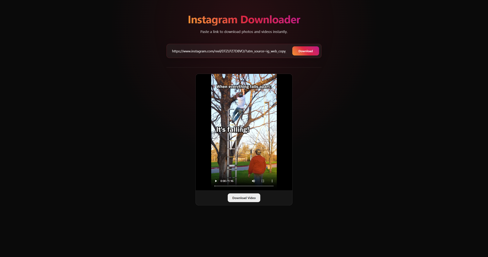

# Instagram Downloader

A clean and efficient web application to download Instagram videos and photos. Built with Next.js and Puppeteer.



## Features

- **Download Photos & Videos**: Easily download content from Instagram public posts.
- **Clean UI**: Simple and intuitive interface.
- **Fast Processing**: Leveraging Puppeteer for reliable content extraction.

## Tech Stack

This project uses the following technologies:

- **Framework**: [Next.js](https://nextjs.org) (v15)
- **Frontend**: React (v19)
- **Automation**: [Puppeteer](https://pptr.dev) & Puppeteer Core
- **Styling**: CSS Modules
- **Analytics**: [Vercel Analytics](https://vercel.com/analytics)
- **Deployment**: Vercel

## Getting Started

Follow these steps to run the project locally.

### Prerequisites

- Node.js installed (v18 or higher recommended)
- npm, yarn, pnpm, or bun

### Installation

1.  Clone the repository:
    ```bash
    git clone https://github.com/mrprince88/instagram-downloader.git
    cd instagram-downloader
    ```

2.  Install dependencies:
    ```bash
    npm install
    # or
    yarn install
    # or
    pnpm install
    ```

### Running the App

Run the development server:

```bash
npm run dev
# or
yarn dev
# or
pnpm dev
# or
bun dev
```

Open [http://localhost:3000](http://localhost:3000) with your browser to see the result.

## Learn More

To learn more about Next.js, take a look at the following resources:

- [Next.js Documentation](https://nextjs.org/docs) - learn about Next.js features and API.
- [Learn Next.js](https://nextjs.org/learn) - an interactive Next.js tutorial.

## Deploy on Vercel

The easiest way to deploy your Next.js app is to use the [Vercel Platform](https://vercel.com/new?utm_medium=default-template&filter=next.js&utm_source=create-next-app&utm_campaign=create-next-app-readme) from the creators of Next.js.
